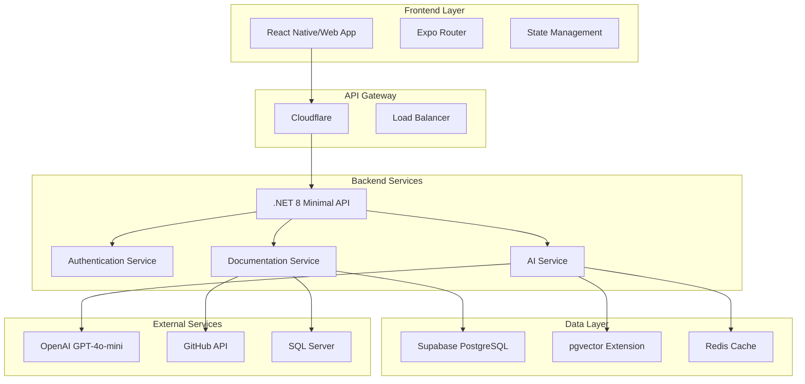

# 🏗️ Arquitectura del Sistema - AutoDocOps

## Resumen Ejecutivo

AutoDocOps implementa una arquitectura moderna, escalable y mantenible basada en principios de Clean Architecture y Domain-Driven Design. El sistema está diseñado para manejar el análisis automático de código .NET y bases de datos SQL Server, generando documentación viva mediante inteligencia artificial.

## Principios Arquitectónicos

### 1. Clean Architecture (Arquitectura Limpia)

La aplicación sigue los principios de Clean Architecture de Robert C. Martin, organizando el código en capas concéntricas donde las dependencias apuntan hacia el centro:

```
┌─────────────────────────────────────┐
│           Presentation              │
│         (API Controllers)           │
├─────────────────────────────────────┤
│           Application               │
│      (Use Cases, Services)          │
├─────────────────────────────────────┤
│            Domain                   │
│    (Entities, Value Objects)        │
├─────────────────────────────────────┤
│         Infrastructure              │
│  (Database, External Services)      │
└─────────────────────────────────────┘
```

### 2. Domain-Driven Design (DDD)

El dominio está claramente definido con:
- **Entidades**: Project, ApiDocumentation, DatabaseSchema
- **Value Objects**: ConnectionConfig, DocumentationConfig
- **Agregados**: Project como raíz de agregado
- **Servicios de Dominio**: Lógica de negocio compleja

### 3. SOLID Principles

- **S**ingle Responsibility: Cada clase tiene una única responsabilidad
- **O**pen/Closed: Extensible sin modificar código existente
- **L**iskov Substitution: Interfaces bien definidas
- **I**nterface Segregation: Interfaces específicas y cohesivas
- **D**ependency Inversion: Dependencias hacia abstracciones

## Arquitectura de Alto Nivel



## Capas de la Aplicación

### 1. Capa de Presentación (API)

**Responsabilidades:**
- Exposición de endpoints HTTP
- Validación de entrada
- Serialización/deserialización
- Manejo de errores HTTP
- Documentación OpenAPI

**Componentes Principales:**
```csharp
// Minimal API Endpoints
app.MapPost("/api/documentation/analyze-dotnet", AnalyzeDotNetHandler);
app.MapPost("/api/documentation/generate-guides", GenerateGuidesHandler);

// Middleware Pipeline
app.UseAuthentication();
app.UseAuthorization();
app.UseRateLimiting();
app.UseErrorHandling();
```

**Características:**
- Minimal API para mejor rendimiento
- AOT (Ahead of Time) compilation
- Source generators para JSON
- Health checks integrados

### 2. Capa de Aplicación

**Responsabilidades:**
- Orquestación de casos de uso
- Lógica de aplicación
- Coordinación entre servicios
- Manejo de transacciones

**Patrones Implementados:**
- **CQRS**: Separación de comandos y consultas
- **MediatR**: Mediator pattern para desacoplamiento
- **Repository Pattern**: Abstracción de acceso a datos

```csharp
public class AnalyzeDotNetApiHandler : IRequestHandler<AnalyzeDotNetApiCommand, AnalyzeDotNetApiResponse>
{
    private readonly ICodeAnalysisService _codeAnalysisService;
    private readonly IOpenAIService _openAIService;
    private readonly IProjectRepository _projectRepository;
    
    public async Task<AnalyzeDotNetApiResponse> Handle(AnalyzeDotNetApiCommand request, CancellationToken cancellationToken)
    {
        // Orquestación del caso de uso
        var metadata = await _codeAnalysisService.ExtractMetadataAsync(request.SourceCode);
        var openApiSpec = await _openAIService.AnalyzeDotNetApiAsync(metadata, request.Language);
        var project = await _projectRepository.GetByIdAsync(request.ProjectId);
        
        // Lógica de negocio
        project.UpdateDocumentation(openApiSpec);
        await _projectRepository.UpdateAsync(project);
        
        return new AnalyzeDotNetApiResponse(openApiSpec);
    }
}
```

### 3. Capa de Dominio

**Responsabilidades:**
- Lógica de negocio central
- Reglas de dominio
- Invariantes del sistema
- Entidades y value objects

**Entidades Principales:**

```csharp
public class Project : BaseEntity
{
    public string Name { get; private set; }
    public ProjectType Type { get; private set; }
    public ProjectStatus Status { get; private set; }
    public ConnectionConfig ConnectionConfig { get; private set; }
    public DocumentationConfig DocumentationConfig { get; private set; }
    
    // Métodos de dominio
    public void ChangeStatus(ProjectStatus status, Guid updatedBy)
    {
        // Validaciones de negocio
        if (Status == ProjectStatus.Analyzing && status == ProjectStatus.Created)
            throw new InvalidOperationException("Cannot revert from analyzing to created");
            
        Status = status;
        UpdateTimestamp(updatedBy);
    }
}
```

**Value Objects:**

```csharp
public class ConnectionConfig
{
    public string ConnectionString { get; init; }
    public string? RepositoryUrl { get; init; }
    public string? Branch { get; init; }
    
    // Validaciones en constructor
    public ConnectionConfig(string connectionString, string? repositoryUrl = null, string? branch = null)
    {
        if (string.IsNullOrWhiteSpace(connectionString))
            throw new ArgumentException("Connection string cannot be empty");
            
        ConnectionString = connectionString;
        RepositoryUrl = repositoryUrl;
        Branch = branch ?? "main";
    }
}
```

### 4. Capa de Infraestructura

**Responsabilidades:**
- Acceso a datos
- Servicios externos
- Implementación de interfaces
- Configuración de dependencias

**Servicios Principales:**

```csharp
public class OpenAIService : IOpenAIService
{
    private readonly OpenAIClient _client;
    private readonly IMemoryCache _cache;
    private readonly ILogger<OpenAIService> _logger;
    
    public async Task<string> AnalyzeDotNetApiAsync(string sourceCode, string language)
    {
        var cacheKey = $"analyze_{sourceCode.GetHashCode()}_{language}";
        
        if (_cache.TryGetValue(cacheKey, out string cachedResult))
            return cachedResult;
            
        var prompt = BuildAnalysisPrompt(sourceCode, language);
        var response = await _client.GetChatCompletionsAsync(prompt);
        
        _cache.Set(cacheKey, response, TimeSpan.FromHours(1));
        return response;
    }
}
```

## Patrones de Diseño Implementados

### 1. Repository Pattern

```csharp
public interface IProjectRepository
{
    Task<Project?> GetByIdAsync(Guid id);
    Task<IEnumerable<Project>> GetByUserIdAsync(Guid userId);
    Task<Project> CreateAsync(Project project);
    Task UpdateAsync(Project project);
    Task DeleteAsync(Guid id);
}

public class ProjectRepository : IProjectRepository
{
    private readonly ApplicationDbContext _context;
    
    public async Task<Project?> GetByIdAsync(Guid id)
    {
        return await _context.Projects
            .Include(p => p.ApiDocumentations)
            .Include(p => p.DatabaseSchemas)
            .FirstOrDefaultAsync(p => p.Id == id);
    }
}
```

### 2. Factory Pattern

```csharp
public interface IDocumentationGeneratorFactory
{
    IDocumentationGenerator CreateGenerator(ProjectType type);
}

public class DocumentationGeneratorFactory : IDocumentationGeneratorFactory
{
    public IDocumentationGenerator CreateGenerator(ProjectType type)
    {
        return type switch
        {
            ProjectType.DotNetApi => new DotNetApiDocumentationGenerator(),
            ProjectType.SqlServerDatabase => new SqlServerDocumentationGenerator(),
            _ => throw new NotSupportedException($"Project type {type} not supported")
        };
    }
}
```

### 3. Strategy Pattern

```csharp
public interface IAnalysisStrategy
{
    Task<AnalysisResult> AnalyzeAsync(string input, AnalysisOptions options);
}

public class DotNetAnalysisStrategy : IAnalysisStrategy
{
    public async Task<AnalysisResult> AnalyzeAsync(string sourceCode, AnalysisOptions options)
    {
        // Implementación específica para .NET
        var syntaxTree = CSharpSyntaxTree.ParseText(sourceCode);
        var compilation = CSharpCompilation.Create("Analysis", new[] { syntaxTree });
        
        // Análisis del código
        return new AnalysisResult(extractedMetadata);
    }
}
```

## Base de Datos y Persistencia

### Esquema de Base de Datos

```sql
-- Tabla principal de proyectos
CREATE TABLE projects (
    id UUID PRIMARY KEY DEFAULT gen_random_uuid(),
    name VARCHAR(200) NOT NULL,
    description TEXT,
    type project_type NOT NULL,
    status project_status NOT NULL DEFAULT 'created',
    connection_config JSONB,
    documentation_config JSONB,
    preferred_language language_enum NOT NULL DEFAULT 'spanish',
    created_at TIMESTAMP WITH TIME ZONE DEFAULT NOW(),
    updated_at TIMESTAMP WITH TIME ZONE DEFAULT NOW(),
    created_by UUID NOT NULL,
    updated_by UUID NOT NULL
);

-- Tabla de documentación de APIs
CREATE TABLE api_documentations (
    id UUID PRIMARY KEY DEFAULT gen_random_uuid(),
    project_id UUID NOT NULL REFERENCES projects(id) ON DELETE CASCADE,
    openapi_specification JSONB NOT NULL,
    swagger_ui_url TEXT,
    postman_collection JSONB,
    typescript_sdk TEXT,
    csharp_sdk TEXT,
    usage_guides TEXT,
    created_at TIMESTAMP WITH TIME ZONE DEFAULT NOW()
);

-- Tabla de esquemas de base de datos
CREATE TABLE database_schemas (
    id UUID PRIMARY KEY DEFAULT gen_random_uuid(),
    project_id UUID NOT NULL REFERENCES projects(id) ON DELETE CASCADE,
    schema_definition TEXT NOT NULL,
    er_diagram_mermaid TEXT,
    data_dictionary JSONB,
    embeddings vector(1536), -- pgvector para búsqueda semántica
    created_at TIMESTAMP WITH TIME ZONE DEFAULT NOW()
);
```

### Configuración de Entity Framework

```csharp
public class ApplicationDbContext : DbContext
{
    public DbSet<Project> Projects { get; set; }
    public DbSet<ApiDocumentation> ApiDocumentations { get; set; }
    public DbSet<DatabaseSchema> DatabaseSchemas { get; set; }
    
    protected override void OnModelCreating(ModelBuilder modelBuilder)
    {
        // Configuración de entidades
        modelBuilder.ApplyConfiguration(new ProjectConfiguration());
        modelBuilder.ApplyConfiguration(new ApiDocumentationConfiguration());
        modelBuilder.ApplyConfiguration(new DatabaseSchemaConfiguration());
        
        // Configuración de pgvector
        modelBuilder.HasPostgresExtension("vector");
    }
}

public class ProjectConfiguration : IEntityTypeConfiguration<Project>
{
    public void Configure(EntityTypeBuilder<Project> builder)
    {
        builder.ToTable("projects");
        
        builder.HasKey(p => p.Id);
        
        builder.Property(p => p.Name)
            .HasMaxLength(200)
            .IsRequired();
            
        builder.Property(p => p.ConnectionConfig)
            .HasConversion(
                v => JsonSerializer.Serialize(v, JsonSerializerOptions.Default),
                v => JsonSerializer.Deserialize<ConnectionConfig>(v, JsonSerializerOptions.Default))
            .HasColumnType("jsonb");
            
        // Configuración de relaciones
        builder.HasMany(p => p.ApiDocumentations)
            .WithOne()
            .HasForeignKey("ProjectId")
            .OnDelete(DeleteBehavior.Cascade);
    }
}
```

## Servicios de IA y Machine Learning

### Integración con OpenAI

```csharp
public class OpenAIService : IOpenAIService
{
    private readonly OpenAIClient _client;
    private readonly IConfiguration _configuration;
    private readonly IMemoryCache _cache;
    
    public async Task<string> AnalyzeDotNetApiAsync(string sourceCode, string language)
    {
        var systemPrompt = language == "es" 
            ? "Eres un experto en análisis de APIs .NET. Analiza el código y genera una especificación OpenAPI 3.1 completa."
            : "You are an expert in .NET API analysis. Analyze the code and generate a complete OpenAPI 3.1 specification.";
            
        var userPrompt = $@"
Analiza el siguiente código .NET y genera una especificación OpenAPI 3.1:

```csharp
{sourceCode}
```

Incluye:
1. Información básica de la API
2. Todos los endpoints con métodos HTTP
3. Modelos de datos (schemas)
4. Parámetros y respuestas
5. Códigos de estado HTTP
6. Ejemplos de uso

Responde únicamente con JSON válido de OpenAPI 3.1.";

        var chatRequest = new ChatCompletionsOptions()
        {
            DeploymentName = "gpt-4o-mini",
            Messages = {
                new ChatRequestSystemMessage(systemPrompt),
                new ChatRequestUserMessage(userPrompt)
            },
            Temperature = 0.1f,
            MaxTokens = 4000
        };
        
        var response = await _client.GetChatCompletionsAsync(chatRequest);
        return response.Value.Choices[0].Message.Content;
    }
}
```

### Búsqueda Semántica con pgvector

```csharp
public class EmbeddingService : IEmbeddingService
{
    private readonly OpenAIClient _client;
    private readonly ApplicationDbContext _context;
    
    public async Task<float[]> GenerateEmbeddingAsync(string text)
    {
        var embeddingRequest = new EmbeddingsOptions("text-embedding-ada-002", new[] { text });
        var response = await _client.GetEmbeddingsAsync(embeddingRequest);
        
        return response.Value.Data[0].Embedding.ToArray();
    }
    
    public async Task<IEnumerable<DatabaseSchema>> SearchSimilarSchemasAsync(string query, int limit = 5)
    {
        var queryEmbedding = await GenerateEmbeddingAsync(query);
        var embeddingString = $"[{string.Join(",", queryEmbedding)}]";
        
        var sql = @"
            SELECT id, project_id, schema_definition, er_diagram_mermaid, data_dictionary,
                   embeddings <-> @queryEmbedding::vector AS distance
            FROM database_schemas
            WHERE embeddings IS NOT NULL
            ORDER BY distance
            LIMIT @limit";
            
        return await _context.DatabaseSchemas
            .FromSqlRaw(sql, new NpgsqlParameter("queryEmbedding", embeddingString), 
                            new NpgsqlParameter("limit", limit))
            .ToListAsync();
    }
}
```

## Seguridad y Autenticación

### Autenticación JWT con Supabase

```csharp
public class JwtAuthenticationService : IAuthenticationService
{
    private readonly IConfiguration _configuration;
    private readonly SupabaseClient _supabaseClient;
    
    public async Task<AuthenticationResult> AuthenticateAsync(string token)
    {
        try
        {
            var user = await _supabaseClient.Auth.GetUser(token);
            
            if (user?.User == null)
                return AuthenticationResult.Failed("Invalid token");
                
            var claims = new[]
            {
                new Claim(ClaimTypes.NameIdentifier, user.User.Id),
                new Claim(ClaimTypes.Email, user.User.Email),
                new Claim("supabase_user_id", user.User.Id)
            };
            
            var identity = new ClaimsIdentity(claims, "jwt");
            var principal = new ClaimsPrincipal(identity);
            
            return AuthenticationResult.Success(principal);
        }
        catch (Exception ex)
        {
            return AuthenticationResult.Failed($"Authentication failed: {ex.Message}");
        }
    }
}
```

### Row Level Security (RLS)

```sql
-- Habilitar RLS en todas las tablas
ALTER TABLE projects ENABLE ROW LEVEL SECURITY;
ALTER TABLE api_documentations ENABLE ROW LEVEL SECURITY;
ALTER TABLE database_schemas ENABLE ROW LEVEL SECURITY;

-- Política para proyectos: usuarios solo pueden ver sus propios proyectos
CREATE POLICY "Users can view own projects" ON projects
    FOR SELECT USING (auth.uid() = created_by);

CREATE POLICY "Users can insert own projects" ON projects
    FOR INSERT WITH CHECK (auth.uid() = created_by);

CREATE POLICY "Users can update own projects" ON projects
    FOR UPDATE USING (auth.uid() = created_by);

-- Políticas para documentación: basadas en ownership del proyecto
CREATE POLICY "Users can view own project documentation" ON api_documentations
    FOR SELECT USING (
        EXISTS (
            SELECT 1 FROM projects 
            WHERE projects.id = api_documentations.project_id 
            AND projects.created_by = auth.uid()
        )
    );
```

## Performance y Optimización

### Caching Strategy

```csharp
public class CachedOpenAIService : IOpenAIService
{
    private readonly IOpenAIService _innerService;
    private readonly IMemoryCache _memoryCache;
    private readonly IDistributedCache _distributedCache;
    
    public async Task<string> AnalyzeDotNetApiAsync(string sourceCode, string language)
    {
        var cacheKey = $"analyze_dotnet_{ComputeHash(sourceCode)}_{language}";
        
        // Intentar cache en memoria primero
        if (_memoryCache.TryGetValue(cacheKey, out string memoryResult))
            return memoryResult;
            
        // Intentar cache distribuido
        var distributedResult = await _distributedCache.GetStringAsync(cacheKey);
        if (!string.IsNullOrEmpty(distributedResult))
        {
            _memoryCache.Set(cacheKey, distributedResult, TimeSpan.FromMinutes(30));
            return distributedResult;
        }
        
        // Generar nuevo resultado
        var result = await _innerService.AnalyzeDotNetApiAsync(sourceCode, language);
        
        // Guardar en ambos caches
        _memoryCache.Set(cacheKey, result, TimeSpan.FromMinutes(30));
        await _distributedCache.SetStringAsync(cacheKey, result, new DistributedCacheEntryOptions
        {
            AbsoluteExpirationRelativeToNow = TimeSpan.FromHours(24)
        });
        
        return result;
    }
}
```

### Connection Pooling

```csharp
public class DatabaseConfiguration
{
    public static void ConfigureNpgsql(IServiceCollection services, string connectionString)
    {
        services.AddDbContext<ApplicationDbContext>(options =>
        {
            options.UseNpgsql(connectionString, npgsqlOptions =>
            {
                npgsqlOptions.EnableRetryOnFailure(
                    maxRetryCount: 3,
                    maxRetryDelay: TimeSpan.FromSeconds(5),
                    errorCodesToAdd: null);
                    
                npgsqlOptions.UseVector(); // pgvector support
            });
            
            // Pool de conexiones optimizado
            options.EnableServiceProviderCaching();
            options.EnableSensitiveDataLogging(false);
        });
        
        // Configurar pool de conexiones
        services.Configure<NpgsqlConnectionStringBuilder>(builder =>
        {
            builder.Pooling = true;
            builder.MinPoolSize = 5;
            builder.MaxPoolSize = 100;
            builder.ConnectionLifetime = 300; // 5 minutos
        });
    }
}
```

## Monitoreo y Observabilidad

### Health Checks

```csharp
public class DatabaseHealthCheck : IHealthCheck
{
    private readonly ApplicationDbContext _context;
    
    public async Task<HealthCheckResult> CheckHealthAsync(HealthCheckContext context, CancellationToken cancellationToken = default)
    {
        try
        {
            await _context.Database.ExecuteSqlRawAsync("SELECT 1", cancellationToken);
            return HealthCheckResult.Healthy("Database is responsive");
        }
        catch (Exception ex)
        {
            return HealthCheckResult.Unhealthy("Database is not responsive", ex);
        }
    }
}

public class OpenAIHealthCheck : IHealthCheck
{
    private readonly IOpenAIService _openAIService;
    
    public async Task<HealthCheckResult> CheckHealthAsync(HealthCheckContext context, CancellationToken cancellationToken = default)
    {
        try
        {
            // Test simple para verificar conectividad
            await _openAIService.AnalyzeDotNetApiAsync("// test", "en");
            return HealthCheckResult.Healthy("OpenAI service is responsive");
        }
        catch (Exception ex)
        {
            return HealthCheckResult.Degraded("OpenAI service is not responsive", ex);
        }
    }
}
```

### Logging y Métricas

```csharp
public class MetricsMiddleware
{
    private readonly RequestDelegate _next;
    private readonly ILogger<MetricsMiddleware> _logger;
    private readonly Counter<int> _requestCounter;
    private readonly Histogram<double> _requestDuration;
    
    public async Task InvokeAsync(HttpContext context)
    {
        var stopwatch = Stopwatch.StartNew();
        
        try
        {
            await _next(context);
        }
        finally
        {
            stopwatch.Stop();
            
            _requestCounter.Add(1, new KeyValuePair<string, object?>("method", context.Request.Method),
                                   new KeyValuePair<string, object?>("endpoint", context.Request.Path));
                                   
            _requestDuration.Record(stopwatch.ElapsedMilliseconds, 
                                  new KeyValuePair<string, object?>("method", context.Request.Method),
                                  new KeyValuePair<string, object?>("status_code", context.Response.StatusCode));
        }
    }
}
```

## Escalabilidad y Deployment

### Containerización

```dockerfile
# Multi-stage build optimizado
FROM mcr.microsoft.com/dotnet/aspnet:8.0-alpine AS base
WORKDIR /app
EXPOSE 8080

# Usuario no-root para seguridad
RUN addgroup -g 1001 -S appgroup && \
    adduser -S appuser -u 1001 -G appgroup
USER appuser

FROM mcr.microsoft.com/dotnet/sdk:8.0-alpine AS build
WORKDIR /src

# Copiar y restaurar dependencias
COPY ["*.csproj", "./"]
RUN dotnet restore

# Copiar código y compilar
COPY . .
RUN dotnet publish -c Release -o /app/publish /p:UseAppHost=false

FROM base AS final
WORKDIR /app
COPY --from=build /app/publish .

# Health check
HEALTHCHECK --interval=30s --timeout=10s --start-period=60s --retries=3 \
    CMD curl -f http://localhost:8080/health || exit 1

ENTRYPOINT ["dotnet", "AutoDocOps.Api.dll"]
```

### Configuración de Fly.io

```toml
# fly.toml
app = "autodocops-api"
primary_region = "mia"

[build]
  dockerfile = "./backend/Dockerfile"

[http_service]
  internal_port = 8080
  force_https = true
  auto_stop_machines = true
  auto_start_machines = true
  min_machines_running = 1

  [http_service.concurrency]
    type = "requests"
    hard_limit = 1000
    soft_limit = 800

[machine]
  memory = "1gb"
  cpu_kind = "shared"
  cpus = 1

# Escalado automático
[scaling]
  min_machines_running = 1
  max_machines_running = 10
```

## Consideraciones de Seguridad

### Validación de Entrada

```csharp
public class AnalyzeDotNetApiRequest
{
    [Required]
    [StringLength(1000000, MinimumLength = 10)]
    public string SourceCode { get; set; } = string.Empty;
    
    [Required]
    [RegularExpression("^(es|en)$")]
    public string Language { get; set; } = "es";
}

public class RequestValidationMiddleware
{
    public async Task InvokeAsync(HttpContext context, RequestDelegate next)
    {
        if (context.Request.ContentLength > 10_000_000) // 10MB limit
        {
            context.Response.StatusCode = 413;
            await context.Response.WriteAsync("Request too large");
            return;
        }
        
        await next(context);
    }
}
```

### Rate Limiting

```csharp
public class RateLimitingConfiguration
{
    public static void Configure(IServiceCollection services)
    {
        services.AddRateLimiter(options =>
        {
            options.AddFixedWindowLimiter("api", limiterOptions =>
            {
                limiterOptions.PermitLimit = 100;
                limiterOptions.Window = TimeSpan.FromMinutes(1);
                limiterOptions.QueueProcessingOrder = QueueProcessingOrder.OldestFirst;
                limiterOptions.QueueLimit = 10;
            });
            
            options.AddFixedWindowLimiter("ai", limiterOptions =>
            {
                limiterOptions.PermitLimit = 10;
                limiterOptions.Window = TimeSpan.FromMinutes(1);
            });
        });
    }
}
```

## Conclusión

La arquitectura de AutoDocOps está diseñada para ser:

- **Escalable**: Puede manejar desde usuarios individuales hasta empresas grandes
- **Mantenible**: Código limpio y bien estructurado facilita el mantenimiento
- **Testeable**: Arquitectura permite testing unitario e integración efectivos
- **Segura**: Múltiples capas de seguridad protegen datos y operaciones
- **Performante**: Optimizaciones de cache y base de datos aseguran respuesta rápida
- **Observabile**: Logging y métricas completas para monitoreo en producción

Esta arquitectura proporciona una base sólida para el crecimiento futuro del producto y la incorporación de nuevas funcionalidades.

