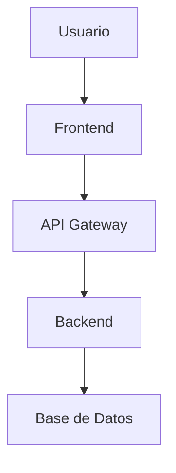

# 🤝 Guía de Contribución - AutoDocOps

¡Gracias por tu interés en contribuir a AutoDocOps! Esta guía te ayudará a entender cómo puedes participar en el desarrollo de este proyecto.

## 📋 Tabla de Contenidos

- [Código de Conducta](#código-de-conducta)
- [Cómo Contribuir](#cómo-contribuir)
- [Configuración del Entorno](#configuración-del-entorno)
- [Estándares de Código](#estándares-de-código)
- [Proceso de Pull Request](#proceso-de-pull-request)
- [Reportar Bugs](#reportar-bugs)
- [Solicitar Funcionalidades](#solicitar-funcionalidades)
- [Documentación](#documentación)
- [Testing](#testing)
- [Comunidad](#comunidad)

## 📜 Código de Conducta

Este proyecto adhiere al [Contributor Covenant Code of Conduct](https://www.contributor-covenant.org/). Al participar, se espera que mantengas este código. Por favor reporta comportamientos inaceptables a [conduct@autodocops.com](mailto:conduct@autodocops.com).

### Nuestros Valores

- **Respeto**: Tratamos a todos con respeto y dignidad
- **Inclusión**: Valoramos la diversidad y creamos un ambiente inclusivo
- **Colaboración**: Trabajamos juntos hacia objetivos comunes
- **Transparencia**: Comunicamos abierta y honestamente
- **Excelencia**: Nos esforzamos por la calidad en todo lo que hacemos

## 🚀 Cómo Contribuir

Hay muchas formas de contribuir a AutoDocOps:

### 💻 Desarrollo de Código
- Implementar nuevas funcionalidades
- Corregir bugs
- Mejorar el rendimiento
- Refactorizar código existente

### 📚 Documentación
- Mejorar la documentación existente
- Crear tutoriales y guías
- Traducir documentación
- Corregir errores tipográficos

### 🧪 Testing
- Escribir tests unitarios
- Crear tests de integración
- Realizar testing manual
- Reportar bugs

### 🎨 Diseño y UX
- Mejorar la interfaz de usuario
- Crear mockups y prototipos
- Optimizar la experiencia de usuario
- Diseñar iconos y assets

### 🌍 Comunidad
- Ayudar a otros usuarios
- Responder preguntas en issues
- Participar en discusiones
- Organizar eventos

## ⚙️ Configuración del Entorno

### Prerrequisitos

- [.NET 8 SDK](https://dotnet.microsoft.com/download/dotnet/8.0)
- [Node.js 18+](https://nodejs.org/)
- [Git](https://git-scm.com/)
- [Docker](https://docker.com/) (opcional)
- [Visual Studio Code](https://code.visualstudio.com/) (recomendado)

### Configuración Inicial

1. **Fork del Repositorio**
   ```bash
   # Hacer fork en GitHub, luego clonar
   git clone https://github.com/tu-usuario/AutoDocOps.git
   cd AutoDocOps
   ```

2. **Configurar Remotes**
   ```bash
   git remote add upstream https://github.com/autodocops/AutoDocOps.git
   git remote -v
   ```

3. **Instalar Dependencias**
   ```bash
   # Backend
   cd backend
   dotnet restore
   dotnet build
   
   # Frontend
   cd ../frontend/AutoDocOps-Frontend
   npm install
   ```

4. **Configurar Variables de Entorno**
   ```bash
   # Copiar archivos de ejemplo
   cp backend/.env.example backend/.env
   cp frontend/AutoDocOps-Frontend/.env.example frontend/AutoDocOps-Frontend/.env.local
   
   # Editar con tus configuraciones
   ```

5. **Ejecutar Tests**
   ```bash
   # Backend
   cd backend
   dotnet test
   
   # Frontend
   cd ../frontend/AutoDocOps-Frontend
   npm test
   ```

### Extensiones Recomendadas para VS Code

```json
{
  "recommendations": [
    "ms-dotnettools.csharp",
    "ms-dotnettools.vscode-dotnet-runtime",
    "bradlc.vscode-tailwindcss",
    "esbenp.prettier-vscode",
    "ms-vscode.vscode-typescript-next",
    "expo.vscode-expo-tools",
    "ms-vscode.test-adapter-converter"
  ]
}
```

## 📏 Estándares de Código

### Backend (.NET)

#### Convenciones de Nomenclatura
```csharp
// Clases: PascalCase
public class ProjectService { }

// Métodos: PascalCase
public async Task<Project> GetProjectAsync(Guid id) { }

// Propiedades: PascalCase
public string Name { get; set; }

// Variables locales: camelCase
var projectId = Guid.NewGuid();

// Constantes: PascalCase
public const string DefaultLanguage = "es";

// Campos privados: _camelCase
private readonly ILogger _logger;
```

#### Estructura de Archivos
```
src/
├── AutoDocOps.Domain/
│   ├── Entities/
│   ├── ValueObjects/
│   ├── Enums/
│   └── Interfaces/
├── AutoDocOps.Application/
│   ├── Commands/
│   ├── Queries/
│   ├── Handlers/
│   └── Services/
├── AutoDocOps.Infrastructure/
│   ├── Data/
│   ├── Services/
│   └── Configuration/
└── AutoDocOps.Api/
    ├── Controllers/
    ├── Middleware/
    └── Extensions/
```

#### Reglas de Código
- Usar `nullable enable` en todos los proyectos
- File-scoped namespaces
- Usar `var` cuando el tipo es obvio
- Métodos async deben terminar en `Async`
- Usar `ConfigureAwait(false)` en bibliotecas
- Documentar APIs públicas con XML comments

```csharp
namespace AutoDocOps.Domain.Entities;

/// <summary>
/// Representa un proyecto de documentación
/// </summary>
public class Project : BaseEntity
{
    /// <summary>
    /// Nombre del proyecto
    /// </summary>
    public string Name { get; private set; } = string.Empty;
    
    /// <summary>
    /// Actualiza la información básica del proyecto
    /// </summary>
    /// <param name="name">Nuevo nombre</param>
    /// <param name="description">Nueva descripción</param>
    /// <param name="updatedBy">Usuario que realiza la actualización</param>
    public void UpdateBasicInfo(string name, string description, Guid updatedBy)
    {
        Name = name ?? throw new ArgumentNullException(nameof(name));
        Description = description ?? throw new ArgumentNullException(nameof(description));
        UpdateTimestamp(updatedBy);
    }
}
```

### Frontend (React/TypeScript)

#### Convenciones de Nomenclatura
```typescript
// Componentes: PascalCase
export const ProjectList: React.FC = () => { };

// Hooks: camelCase con prefijo 'use'
export const useProjects = () => { };

// Tipos/Interfaces: PascalCase
interface ProjectData {
  id: string;
  name: string;
}

// Variables: camelCase
const projectId = 'abc-123';

// Constantes: SCREAMING_SNAKE_CASE
const API_BASE_URL = 'https://api.example.com';
```

#### Estructura de Componentes
```typescript
import React from 'react';
import { StyleSheet, View, Text } from 'react-native';

interface ProjectCardProps {
  project: Project;
  onPress: (project: Project) => void;
}

export const ProjectCard: React.FC<ProjectCardProps> = ({ 
  project, 
  onPress 
}) => {
  const handlePress = () => {
    onPress(project);
  };

  return (
    <View style={styles.container}>
      <Text style={styles.title}>{project.name}</Text>
      <Text style={styles.description}>{project.description}</Text>
    </View>
  );
};

const styles = StyleSheet.create({
  container: {
    padding: 16,
    backgroundColor: '#fff',
    borderRadius: 8,
  },
  title: {
    fontSize: 18,
    fontWeight: 'bold',
  },
  description: {
    fontSize: 14,
    color: '#666',
  },
});
```

#### Reglas de TypeScript
- Usar TypeScript estricto
- Definir tipos explícitos para props
- Usar interfaces para objetos complejos
- Evitar `any`, usar `unknown` si es necesario
- Usar optional chaining (`?.`) y nullish coalescing (`??`)

### Formateo de Código

#### .editorconfig
```ini
root = true

[*]
charset = utf-8
end_of_line = lf
insert_final_newline = true
trim_trailing_whitespace = true

[*.{cs,csx}]
indent_style = space
indent_size = 4

[*.{js,jsx,ts,tsx,json}]
indent_style = space
indent_size = 2

[*.md]
trim_trailing_whitespace = false
```

#### Prettier (Frontend)
```json
{
  "semi": true,
  "trailingComma": "es5",
  "singleQuote": true,
  "printWidth": 80,
  "tabWidth": 2,
  "useTabs": false
}
```

## 🔄 Proceso de Pull Request

### 1. Preparación

```bash
# Sincronizar con upstream
git checkout main
git pull upstream main
git push origin main

# Crear rama feature
git checkout -b feature/nueva-funcionalidad
```

### 2. Desarrollo

- Hacer commits pequeños y frecuentes
- Usar mensajes de commit descriptivos
- Seguir [Conventional Commits](https://www.conventionalcommits.org/)

```bash
# Ejemplos de commits
git commit -m "feat: add project creation endpoint"
git commit -m "fix: resolve null reference in project service"
git commit -m "docs: update API documentation"
git commit -m "test: add unit tests for project entity"
```

### 3. Testing

```bash
# Ejecutar todos los tests
cd backend && dotnet test
cd frontend/AutoDocOps-Frontend && npm test

# Verificar cobertura
dotnet test --collect:"XPlat Code Coverage"
```

### 4. Crear Pull Request

#### Título del PR
- Usar formato: `[tipo]: descripción breve`
- Ejemplos:
  - `feat: add semantic search functionality`
  - `fix: resolve authentication token expiration`
  - `docs: improve deployment guide`

#### Descripción del PR
```markdown
## 📝 Descripción
Breve descripción de los cambios realizados.

## 🎯 Tipo de Cambio
- [ ] Bug fix (cambio que corrige un issue)
- [ ] Nueva funcionalidad (cambio que agrega funcionalidad)
- [ ] Breaking change (cambio que rompe compatibilidad)
- [ ] Documentación (cambios solo en documentación)

## 🧪 Testing
- [ ] Tests unitarios agregados/actualizados
- [ ] Tests de integración agregados/actualizados
- [ ] Tests manuales realizados

## 📋 Checklist
- [ ] Mi código sigue las convenciones del proyecto
- [ ] He realizado una auto-revisión de mi código
- [ ] He comentado mi código en áreas complejas
- [ ] He actualizado la documentación correspondiente
- [ ] Mis cambios no generan nuevas advertencias
- [ ] He agregado tests que prueban mi funcionalidad
- [ ] Todos los tests nuevos y existentes pasan

## 📸 Screenshots (si aplica)
Agregar screenshots para cambios de UI.

## 🔗 Issues Relacionados
Closes #123
```

### 5. Revisión de Código

#### Para Revisores
- Verificar que el código sigue las convenciones
- Probar la funcionalidad localmente
- Revisar tests y cobertura
- Verificar documentación actualizada
- Dar feedback constructivo

#### Para Autores
- Responder a comentarios de manera constructiva
- Realizar cambios solicitados
- Mantener la rama actualizada con main

### 6. Merge

- Solo maintainers pueden hacer merge
- Se requiere al menos una aprobación
- Todos los checks de CI deben pasar
- Se usa "Squash and merge" para mantener historial limpio

## 🐛 Reportar Bugs

### Antes de Reportar

1. Verificar que no sea un issue conocido
2. Buscar en issues existentes
3. Probar con la última versión
4. Reproducir el bug consistentemente

### Template de Bug Report

```markdown
**Descripción del Bug**
Descripción clara y concisa del bug.

**Pasos para Reproducir**
1. Ir a '...'
2. Hacer clic en '....'
3. Scrollear hacia abajo hasta '....'
4. Ver error

**Comportamiento Esperado**
Descripción clara de lo que esperabas que pasara.

**Screenshots**
Si aplica, agregar screenshots para explicar el problema.

**Información del Entorno:**
 - OS: [e.g. iOS, Windows, macOS]
 - Browser [e.g. chrome, safari]
 - Versión [e.g. 22]
 - Versión de AutoDocOps [e.g. 1.0.0]

**Contexto Adicional**
Cualquier otro contexto sobre el problema.
```

## ✨ Solicitar Funcionalidades

### Template de Feature Request

```markdown
**¿Tu solicitud está relacionada con un problema?**
Descripción clara del problema. Ej. "Siempre me frustra cuando [...]"

**Describe la solución que te gustaría**
Descripción clara y concisa de lo que quieres que pase.

**Describe alternativas que has considerado**
Descripción clara de cualquier solución o funcionalidad alternativa.

**Contexto Adicional**
Cualquier otro contexto o screenshots sobre la solicitud.
```

## 📚 Documentación

### Tipos de Documentación

1. **README**: Información general del proyecto
2. **API Docs**: Documentación de endpoints
3. **Architecture**: Documentación técnica
4. **Deployment**: Guías de despliegue
5. **Contributing**: Esta guía
6. **Changelog**: Historial de cambios

### Estándares de Documentación

- Usar Markdown para toda la documentación
- Incluir ejemplos de código
- Mantener documentación actualizada con cambios
- Usar diagramas cuando sea útil
- Escribir en español para documentación de usuario
- Usar inglés para documentación técnica interna

### Diagramas

Usar Mermaid para diagramas:



## 🧪 Testing

### Tipos de Tests

1. **Unit Tests**: Lógica de negocio aislada
2. **Integration Tests**: Interacción entre componentes
3. **E2E Tests**: Flujos completos de usuario
4. **Performance Tests**: Rendimiento y carga

### Estándares de Testing

#### Backend
```csharp
[Fact]
public void Project_ShouldCreateWithValidData()
{
    // Arrange
    var name = "Test Project";
    var description = "Test Description";
    
    // Act
    var project = new Project(name, description, /* ... */);
    
    // Assert
    project.Name.Should().Be(name);
    project.Description.Should().Be(description);
}
```

#### Frontend
```typescript
describe('ProjectCard', () => {
  it('should render project information', () => {
    const project = {
      id: '1',
      name: 'Test Project',
      description: 'Test Description'
    };
    
    render(<ProjectCard project={project} onPress={jest.fn()} />);
    
    expect(screen.getByText('Test Project')).toBeInTheDocument();
    expect(screen.getByText('Test Description')).toBeInTheDocument();
  });
});
```

### Cobertura de Tests

- Mínimo 80% de cobertura para nuevo código
- 100% de cobertura para lógica crítica de negocio
- Tests de regresión para bugs corregidos

## 🌍 Comunidad

### Canales de Comunicación

- **GitHub Issues**: Bugs y feature requests
- **GitHub Discussions**: Preguntas y discusiones
- **Discord**: Chat en tiempo real
- **Email**: Contacto directo con maintainers

### Eventos

- **Office Hours**: Sesiones semanales de Q&A
- **Contributor Meetups**: Reuniones mensuales
- **Hackathons**: Eventos trimestrales

### Reconocimiento

- Contributors destacados en README
- Badges especiales en Discord
- Invitaciones a eventos exclusivos
- Swag de AutoDocOps

## 🎯 Roadmap de Contribuciones

### Beginner Friendly
- Corrección de typos
- Mejoras de documentación
- Tests unitarios simples
- Traducciones

### Intermediate
- Nuevas funcionalidades pequeñas
- Refactoring de código
- Mejoras de performance
- Tests de integración

### Advanced
- Arquitectura de nuevas features
- Optimizaciones complejas
- Integración con servicios externos
- Mentoring de nuevos contributors

## 📞 Contacto

- **Email**: contributors@autodocops.com
- **Discord**: [AutoDocOps Community](https://discord.gg/autodocops)
- **Twitter**: [@autodocops](https://twitter.com/autodocops)

---

¡Gracias por contribuir a AutoDocOps! Juntos estamos construyendo el futuro de la documentación automática. 🚀

